# Urban Layers: Yerevan through time

```mermaid
flowchart TD

subgraph group_pipeline["Data pipeline"]
  node_fetch["Building fetch &amp; assembly<br/>Python pipeline<br/>[fetch_buildings.py]"]
  node_paths["Path resolution<br/>Python boundary<br/>[paths.py]"]
  node_osm_live["Live OSM fetch<br/>OSM adapter<br/>[osm_live.py]"]
  node_osm_source["OSM source processing<br/>Python module<br/>[osm_source.py]"]
  node_map_data["Generated map data<br/>Build artifact"]
  node_local_server["Local server &amp; offline loop<br/>Python server<br/>[server.py]"]
  node_apply_queue["Apply approved queue<br/>Python pipeline<br/>[apply_queue.py]"]
  node_split_detection["OSM split detection<br/>Python pipeline<br/>[detect_splits.py]"]
end

subgraph group_sources["Tracked source data"]
  node_inferred["Inferred building eras<br/>JSON source"]
  node_suggestions["Research &amp; suggestions<br/>JSON source<br/>[suggestions.json]"]
  node_water["Water geometry<br/>GeoJSON source<br/>[water.geojson]"]
end

subgraph group_client["Static clients"]
  node_map_client["Public/editor map<br/>MapLibre client<br/>[map.js]"]
  node_map_page["Map page<br/>HTML entry<br/>[index.html]"]
  node_review_page["Reviewer UI<br/>HTML entry<br/>[review.html]"]
end

subgraph group_api["Submission API"]
  node_suggest_api{{"Suggest endpoint<br/>Pages Function<br/>[suggest.js]"}}
  node_queue_api{{"Queue endpoint<br/>Pages Function<br/>[queue.js]"}}
  node_review_api{{"Review endpoint<br/>Pages Function<br/>[review.js]"}}
end

subgraph group_deploy["Publishing"]
  node_d1[("Review queue<br/>Cloudflare D1")]
  node_build["Public build<br/>Build script<br/>[build_public.sh]"]
  node_public["Static public output<br/>Deployment artifact"]
  node_database_schema["Queue database schema<br/>SQL schema<br/>[schema.sql]"]
  node_deployment_docs["Build &amp; deployment guide<br/>Operations documentation"]
end

node_submission_schema["Submission contract<br/>Schema documentation"]

node_paths -->|"resolves paths"| node_fetch
node_osm_live -->|"OSM geometry &amp; tags"| node_fetch
node_osm_source -->|"source processing"| node_fetch
node_inferred -->|"inferred eras"| node_fetch
node_suggestions -->|"durable evidence"| node_fetch
node_water -->|"water layer"| node_fetch
node_fetch -->|"generates"| node_map_data
node_map_page -->|"loads"| node_map_client
node_map_client -->|"renders"| node_map_data
node_review_page -->|"shares map behavior"| node_map_client
node_map_client -->|"submits suggestion"| node_suggest_api
node_submission_schema -.->|"validates against"| node_suggest_api
node_submission_schema -.->|"validates against"| node_apply_queue
node_suggest_api -->|"stores untrusted input"| node_d1
node_queue_api -->|"reads queue"| node_d1
node_review_api -->|"moderates records"| node_d1
node_review_page -->|"loads queue"| node_queue_api
node_review_page -->|"submits decision"| node_review_api
node_local_server -->|"serves locally"| node_map_client
node_local_server -->|"supports offline workflow"| node_apply_queue
node_apply_queue -->|"checks identity changes"| node_split_detection
node_apply_queue -->|"merges approved evidence"| node_suggestions
node_build -->|"assembles"| node_public
node_map_data -->|"includes generated data"| node_build
node_database_schema -.->|"defines"| node_d1
node_deployment_docs -.->|"documents"| node_build

click node_fetch "https://github.com/avmonte/urbanlayers/blob/main/pipeline/fetch_buildings.py"
click node_paths "https://github.com/avmonte/urbanlayers/blob/main/pipeline/paths.py"
click node_osm_live "https://github.com/avmonte/urbanlayers/blob/main/pipeline/osm_live.py"
click node_osm_source "https://github.com/avmonte/urbanlayers/blob/main/pipeline/osm_source.py"
click node_inferred "https://github.com/avmonte/urbanlayers/blob/main/data/source/inferred_buildings.json"
click node_suggestions "https://github.com/avmonte/urbanlayers/blob/main/data/source/suggestions.json"
click node_water "https://github.com/avmonte/urbanlayers/blob/main/data/source/water.geojson"
click node_map_client "https://github.com/avmonte/urbanlayers/blob/main/web/map.js"
click node_map_page "https://github.com/avmonte/urbanlayers/blob/main/web/index.html"
click node_review_page "https://github.com/avmonte/urbanlayers/blob/main/web/review.html"
click node_submission_schema "https://github.com/avmonte/urbanlayers/blob/main/docs/submission-schema.md"
click node_suggest_api "https://github.com/avmonte/urbanlayers/blob/main/functions/api/suggest.js"
click node_queue_api "https://github.com/avmonte/urbanlayers/blob/main/functions/api/queue.js"
click node_review_api "https://github.com/avmonte/urbanlayers/blob/main/functions/api/review.js"
click node_local_server "https://github.com/avmonte/urbanlayers/blob/main/pipeline/server.py"
click node_apply_queue "https://github.com/avmonte/urbanlayers/blob/main/pipeline/apply_queue.py"
click node_split_detection "https://github.com/avmonte/urbanlayers/blob/main/pipeline/detect_splits.py"
click node_build "https://github.com/avmonte/urbanlayers/blob/main/build_public.sh"
click node_database_schema "https://github.com/avmonte/urbanlayers/blob/main/schema.sql"
click node_deployment_docs "https://github.com/avmonte/urbanlayers/blob/main/docs/build-and-deploy.md"

classDef toneNeutral fill:#f8fafc,stroke:#334155,stroke-width:1.5px,color:#0f172a
classDef toneBlue fill:#dbeafe,stroke:#2563eb,stroke-width:1.5px,color:#172554
classDef toneAmber fill:#fef3c7,stroke:#d97706,stroke-width:1.5px,color:#78350f
classDef toneMint fill:#dcfce7,stroke:#16a34a,stroke-width:1.5px,color:#14532d
classDef toneRose fill:#ffe4e6,stroke:#e11d48,stroke-width:1.5px,color:#881337
classDef toneIndigo fill:#e0e7ff,stroke:#4f46e5,stroke-width:1.5px,color:#312e81
classDef toneTeal fill:#ccfbf1,stroke:#0f766e,stroke-width:1.5px,color:#134e4a
class node_fetch,node_paths,node_osm_live,node_osm_source,node_map_data,node_local_server,node_apply_queue,node_split_detection toneBlue
class node_inferred,node_suggestions,node_water toneAmber
class node_map_client,node_map_page,node_review_page toneMint
class node_suggest_api,node_queue_api,node_review_api toneRose
class node_d1,node_build,node_public,node_database_schema,node_deployment_docs toneIndigo
class node_submission_schema toneNeutral
```



A map of Yerevan's ~76,000 buildings coloured by when they were built, with a
public form for contributing a year and a review queue behind it.

**Live: [urbanlayers.xyz](https://urbanlayers.xyz)**

Most buildings have no year — that is the point of the project. OSM tags supply
about fifty; the rest are researched by hand or, where two models agree strongly
enough, inferred. Nothing is published as a fact unless the evidence supports
saying so out loud.

## The tree

```
pipeline/   the Python: fetch → merge → serve. paths.py resolves everything
web/        the site (index.html) and the review queue (review.html), sharing
            one map engine. Served at / by pipeline/server.py
functions/  Cloudflare Pages Functions — the name is load-bearing, it is what
            makes functions/api/suggest.js answer /api/suggest
data/
  source/   irreplaceable and tracked: hand-researched years, provenance,
            water, inferred eras
  cache/    re-downloadable: the Geofabrik extract, the Overpass response
  local/    dev state: the offline twin of the D1 queue
build/      regenerable in ~2 minutes
public/     the deploy artifact, assembled by build_public.sh
exp/        local only, gitignored: the era classifier and the one-off
            generators that produce data/source files. Not needed to build
tests/      no framework; run any of them from anywhere
docs/       build-and-deploy.md is the operational reference
```

**Which directory a file is in tells you whether it survives a delete.** Only
`data/source/` holds work that cannot be regenerated.

## Getting started

Python 3.12 or newer.

```bash
pip install -r requirements.txt     # requests + osmium, and nothing else
python3 pipeline/fetch_buildings.py    # ~10s, live OSM → build/
python3 pipeline/server.py 8003     # editor at /, public site at /public/
```

That is the whole dependency list. The era classifier that produced the
inferred spans needs the scientific stack on top, but it lives in `exp/`, which
is not in this repository — nothing about rebuilding the map needs it.

Nothing here is importable as a package — the scripts run directly, and find
each other because running one puts its own directory on `sys.path`.

`server.py` serves `web/` as `/` and routes the data paths to where they
actually live, so the URLs the browser sees are the same ones the deployed site
serves. The whole submit → review → approve loop runs offline with no Cloudflare
account.

Building and deploying for real, the review queue, split detection, the
Cloudflare configuration, and the gotchas that each cost a broken deploy:
**`docs/build-and-deploy.md`**. The submission rules — implemented three times,
in `web/map.js`, `functions/api/suggest.js` and `pipeline/apply_queue.py` — are
specified once in `docs/submission-schema.md`, which is the authority.

## Tests

```bash
for f in tests/*.py; do python3 "$f"; done
```

No framework, no `PYTHONPATH`, no required working directory. Run
`tests/test_parity.py` after touching `pipeline/submission.py`,
`functions/api/_shared.js` or `docs/submission-schema.md` — it proves the Python
and JS validators still agree.

## Licence

Two licences, because the code and the data are not the same thing and only one
of them is mine to license.

**Code — MIT** (`LICENSE`). Everything in `pipeline/`, `web/`, `functions/`,
`tests/` and the build scripts. Take it, fork it, map another city.

**Data — ODbL 1.0** (`LICENSE.data`), © OpenStreetMap contributors.
`data/source/`, `build/` and the tiles in `public/`. Building footprints come
from OSM, and the years researched by hand here are merged into an OSM-derived
database, which makes them a Derivative Database — so they are ODbL too, and
anyone may take the dataset. Attribution is required wherever it is shown.

Note that ODbL is **share-alike, not non-commercial**: §3.1 says the rights
"explicitly include commercial use, and do not exclude any field of endeavour."
Selling something built on this data is fine. Publishing an *improved database*
without releasing it under ODbL is not. A rendered map image is a Produced Work
rather than a Derivative Database, so it carries the attribution requirement but
not share-alike.

The wordmark face, `fonts/Armeniapedia-Kisat.ttf` © 2016 Raffi Kojian, is free
for personal and commercial use and is shipped unmodified.

Third-party libraries keep their own licences: MapLibre GL JS (BSD-3-Clause),
osmium (BSD-2-Clause), requests (Apache-2.0) and certifi (MPL-2.0). That is the
whole list — the map builds on three Python packages and one JS one.

Contributions: `CONTRIBUTING.md`.
